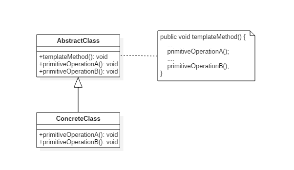
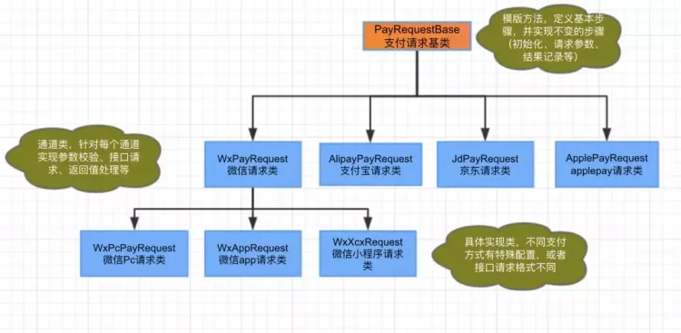

# DesignPatterns
常用设计模式实战

## 原则

单一职责原则【SINGLE RESPONSIBILITY PRINCIPLE】: 一个类负责一项职责。
里氏替换原则【LISKOV SUBSTITUTION PRINCIPLE】: 继承与派生的规则。
依赖倒置原则【DEPENDENCE INVERSION PRINCIPLE】: 高层模块不应该依赖低层模块，二者都应该依赖其抽象；抽象不应该依赖细节；细节应该依赖抽象。即针对接口编程，不要针对实现编程。
接口隔离原则【INTERFACE SEGREGATION PRINCIPLE】: 建立单一接口，不要建立庞大臃肿的接口，尽量细化接口，接口中的方法尽量少。
迪米特法则【LOW OF DEMETER】: 低耦合，高内聚。
开闭原则【OPEN CLOSE PRINCIPLE】: 一个软件实体如类、模块和函数应该对扩展开放，对修改关闭。
组合/聚合复用原则【Composition/Aggregation Reuse Principle(CARP) 】: 尽量使用组合和聚合少使用继承的关系来达到复用的原则。

## 模板方法
定义算法框架，并将一些步骤的实现延迟到子类。

通过模板方法，子类可以重新定义算法的某些步骤，而不用改变算法的结构。

类图

1.收银台

2.支付回调

## 工厂模式+责任链模式

1.开户

工厂模式＋责任链模式

2.对账获取解析器

使用工厂模式（Factory Pattern）的一种变体：
通过支付方式（interfaceCode）确定具体使用哪个解析器。
getService方法扮演了工厂的角色，根据名称创建并返回具体的解析器实例。

